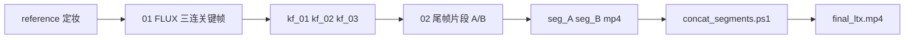

# ltx视频流 · 分镜关键帧 + LTX 短片段 + 拼接

> 与 `wan视频流` 同一套分镜思路：**静图关键帧（FLUX）→ LTX 短视频 → ffmpeg 拼接**。  
> LTX 优势：原生 **首尾双图 keyframe**（`ImageBatch` + `sampling_mode=keyframe`），8GB 上转身分镜通常比 Wan GGUF 更顺。

## 目录位置

| 路径 |
|------|
| `ComfyUI/user/default/workflows/ltx视频流/` |
| 仓库 `workflows/ltx视频流/` |

## 流程总览



## 工作流清单

| 文件 | 说明 |
|------|------|
| `01_FLUX_关键帧_三连图.json` | 与 wan 目录相同：正面 → 微转 → 侧身 |
| `02_LTX_片段_A_首尾_kf01到kf02.json` | **推荐** 首尾补间 kf_01→kf_02 |
| `02_LTX_片段_B_首尾_kf02到kf03.json` | 第二段 kf_02→kf_03 |
| `02_LTX_单帧_稳态_kf03.json` | 末镜微动（distilled 单图） |
| `02_LTX_开场_稳态_kf01.json` | 开场 1–2 秒定帧（可选） |
| `02_LTX_起始帧_锁定kf01.json` | keyframe 模式只锁第 0 帧，允许后段运动 |
| `03_LTX_三关键帧_起中尾_一次.json` | 三图一次生成（显存高，8GB 优先用 A+B 分段） |
| `concat_segments.ps1` | 拼接 `output/video/ltx_storyboard/` |
| `LTX_模型与模板对照.md` | 模型路径与三种 LTX 模式 |

## 操作步骤

### 1. 关键帧

1. 打开 `01_FLUX_关键帧_三连图`，上传 `reference.png`，Queue。  
2. 将 `output/keyframe/kf_01.png` … `kf_03.png` 复制到 **`ComfyUI/input/keyframe/`**。

（也可用 SDXL/Flux 场景工作流手动出图，命名保持一致即可。）

### 2. LTX 片段

**转身分镜（推荐）**

| 顺序 | 工作流 | 输出前缀 |
|------|--------|----------|
| 1 | `02_LTX_片段_A_首尾_kf01到kf02` | `video/ltx_storyboard/seg_A` |
| 2 | `02_LTX_片段_B_首尾_kf02到kf03` | `video/ltx_storyboard/seg_B` |
| 3（可选） | `02_LTX_单帧_稳态_kf03` | `seg_C` |

每段 **Queue 一次**。默认 **768×432**，**73 帧 @24fps** ≈ 3 秒。

**注意**

- `SaveVideo` 的 `filename_prefix` **不要**含 `|`。  
- `LTX2_SM_Model` → `offload=true`，Gemma → `cpu`（模板已设）。  
- distilled LoRA：`ltx-2.3-22b-distilled-lora-1.1_fro90_ceil72_condsafe.safetensors`（仓库 `distill_loras/` 需拷到 `models/loras/`）。

### 3. 拼接

```powershell
cd C:\ComfyUI\ComfyUI\user\default\workflows\ltx视频流
.\concat_segments.ps1 -Segments seg_A_00001.mp4,seg_B_00001.mp4 -Out final_ltx.mp4
```

## LTX 三种模式（本目录怎么用）

| 模式 | 工作流 | 何时用 |
|------|--------|--------|
| **distilled** | `02_LTX_单帧_稳态_*`、`02_LTX_开场_*` | 单图、微动、定帧 |
| **keyframe + 双图** | `02_LTX_片段_A/B` | **相邻关键帧补间**（分镜核心） |
| **keyframe + 单图** | `02_LTX_起始帧_锁定kf01` | 锁第 0 帧后拉开镜头 |
| **三图 batch** | `03_LTX_三关键帧_*` | 整段转身一次出（更吃显存） |

底层映射见 `ComfyUI_LTX2_SM/load_utils.py`：1 图→第 0 帧；2 图→首+尾；3 图→首+中+尾。

## 与 wan视频流 的选择

| | LTX | Wan GGUF |
|---|-----|----------|
| 首尾补间 | 原生 ImageBatch + keyframe | `WanFirstLastFrame` |
| 8GB 转身 | 通常更稳 | 易虚影，宜短片段 |
| 有声 | 模板带音频解码 | I2V 无声为主 |
| 速度 | 较慢（Gemma+22B） | Lightning 4-step 较快 |

可 **同一套 kf_01~03**：LTX 出主片，Wan 出预览或 B-roll。

## 重建目录

```powershell
python c:\tiger\videoModel\jinFrameComfyUI\install\build_ltx_storyboard_pipeline.py
```

复制到 ComfyUI 后刷新或重启工作流列表。
